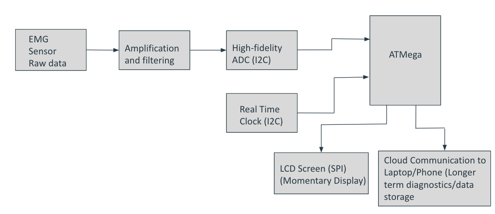
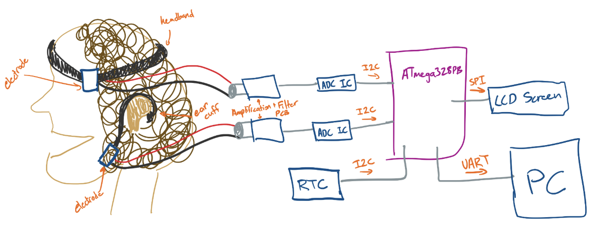

# final-project-skeleton

* Team Number:
* Team Name:
* Team Members:
* GitHub Repository URL:
* GitHub Pages Website URL: [for final submission]

## Final Project Proposal

### 1. Abstract

*In a few sentences, describe your final project.*

The goal of this final project is to detect and track bruxism (involuntary grinding of teeth). The device is worn as a headband when you're asleep, that uses EMG sensors to detect when your jaw muscles contract. It displays the results on an LCD screen that graphs how much time you spent grinding. There could also be a version with day time use, where it simply makes a sound whenever someone is grinding. This will alert them so they consciously stop grinding.

### 2. Motivation

Bruxism can lead to serious complications for a person's dental and oral health. It can cause jaw/tooth pain, wear your teeth down, and contribute to TMJ disorders. Current methods to diagnose nightly bruxism are cumbersome because it can involve having to get a sleep study. Simply wearing the device for a couple of nights offers a simpler solution for doctors to diagnose this issue.

### 3. System Block Diagram

*Show your high level design, as done in WS1 and WS2. What are the critical components in your system? How do they communicate (I2C?, interrupts, ADC, etc.)? What power regulation do you need?*

### 4. Design Sketches

*What will your project look like? Do you have any critical design features? Will you need any special manufacturing techniques to achieve your vision, like power tools, laser cutting, or 3D printing?*

Design considerations:

1. Placement of sensors and electronics
2. Sensitivity of sensor that measures contraction
3. 

Manufacturing

1. There won't be any special manufacturing techniques other than 3D printing and/or laser cutting an enclosure for the electronics.

# Design Sketch

### 5. Software Requirements Specification (SRS)

*Formulate key software requirements here. Think deeply on the design: What must your device do? How will you measure this during validation testing? Create 4 to 8 critical system requirements.*

*These must be testable! See the Final Project Manual Appendix for details. Refer to the table below; replace these examples with your own.*

**5.1 Definitions, Abbreviations**

Here, you will define any special terms, acronyms, or abbreviations you plan to use for hardware

EMG: Electromyography

LCD: Liquid crystal display

Temporalis muscle: Jaw muscle that can be felt contracting on one's temple

**5.2 Functionality**

| ID     | Description                                                                                                           |
| ------ | --------------------------------------------------------------------------------------------------------------------- |
| SRS-01 | The EMG sensor will detect changes in muscle activation of the temporalis muscle                                      |
| SRS-02 | The ADC will convert the analog signals from the EMG into                                                             |
| SRS-03 | The LCD display will show the intensity of grinding over time for the night (using the real time clock to track time) |
| SRS-04 | During the day time a buzzer sounds when the clenching is above a certain threshold                                   |

### 6. Hardware Requirements Specification (SRS)

*Formulate key hardware requirements here. Think deeply on the design: What must your device do? How will you measure this during validation testing? Create 4 to 8 critical system requirements.*

*These must be testable! See the Final Project Manual Appendix for details. Refer to the table below; replace these examples with your own.*

**6.1 Definitions, Abbreviations**

Here, you will define any special terms, acronyms, or abbreviations you plan to use for hardware

ADC (analog to digital conversion)

**6.2 Functionality**

| ID     | Description                                                                           |
| ------ | ------------------------------------------------------------------------------------- |
| HRS-01 | The EMG sensors should be substantially sensitive to detect small muscle contractions |
| HRS-02 | The ADC module should support sufficient resolution for the signal                    |
| HRS-03 | The headband should be somewhat comfortable                                           |
| HRS-04 | Have a real time clock that can track over long periods time                          |

### 7. Bill of Materials (BOM)

*What major components do you need and why? Try to be as specific as possible. Your Hardware & Software Requirements Specifications should inform your component choices.*

*In addition to this written response, copy the Final Project BOM Google Sheet and fill it out with your critical components (think: processors, sensors, actuators). Include the link to your BOM in this section.*

https://docs.google.com/spreadsheets/d/1-zWV1aL9oH2EXkD6tylsm7H7TjFfnVomCbpaZuMzBcA/edit?usp=sharing

### 8. Final Demo Goals

*How will you demonstrate your device on demo day? Will it be strapped to a person, mounted on a bicycle, require outdoor space? Think of any physical, temporal, and other constraints that could affect your planning.*

For demo day we will test the device on one of our team members, and show the LCD updating in real time as well as the buzzer.

### 9. Sprint Planning

*You've got limited time to get this project done! How will you plan your sprint milestones? How will you distribute the work within your team? Review the schedule in the final project manual for exact dates.*

| Milestone  | Functionality Achieved                                       | Distribution of Work                            |
| ---------- | ------------------------------------------------------------ | ----------------------------------------------- |
| Sprint #1  | Reading data from muscle contraction                         | 1 team member sets up hardware, other 2 code it |
| Sprint #2  | LCD graph of clenching time, buzzer that alerts to clenching | all 3 team members code and debug               |
| MVP Demo   | Integration of previous sprints                              | 3 team members optimize embedded system         |
| Final Demo | All parts working along with sleeker mechanical design       | All members work on mechanical design and final |

**This is the end of the Project Proposal section. The remaining sections will be filled out based on the milestone schedule.**

## Sprint Review #1

### Last week's progress

### Current state of project

### Next week's plan

## Sprint Review #2

### Last week's progress

### Current state of project

### Next week's plan

## MVP Demo

1. Show a system block diagram & explain the hardware implementation.
2. Explain your firmware implementation, including application logic and critical drivers you've written.
3. Demo your device.
4. Have you achieved some or all of your Software Requirements Specification (SRS)?

   1. Show how you collected data and the outcomes.
5. Have you achieved some or all of your Hardware Requirements Specification (HRS)?

   1. Show how you collected data and the outcomes.
6. Show off the remaining elements that will make your project whole: mechanical casework, supporting graphical user interface (GUI), web portal, etc.
7. What is the riskiest part remaining of your project?

   1. How do you plan to de-risk this?
8. What questions or help do you need from the teaching team?

## Final Project Report

Don't forget to make the GitHub pages public website!
If you’ve never made a GitHub pages website before, you can follow this webpage (though, substitute your final project repository for the GitHub username one in the quickstart guide):  [https://docs.github.com/en/pages/quickstart](https://docs.github.com/en/pages/quickstart)

### 1. Video

[Insert final project video here]

* The video must demonstrate your key functionality.
* The video must be 5 minutes or less.
* Ensure your video link is accessible to the teaching team. Unlisted YouTube videos or Google Drive uploads with SEAS account access work well.
* Points will be removed if the audio quality is poor - say, if you filmed your video in a noisy electrical engineering lab.

### 2. Images

[Insert final project images here]

*Include photos of your device from a few angles. If you have a casework, show both the exterior and interior (where the good EE bits are!).*

### 3. Results

*What were your results? Namely, what was the final solution/design to your problem?*

#### 3.1 Software Requirements Specification (SRS) Results

*Based on your quantified system performance, comment on how you achieved or fell short of your expected requirements.*

*Did your requirements change? If so, why? Failing to meet a requirement is acceptable; understanding the reason why is critical!*

*Validate at least two requirements, showing how you tested and your proof of work (videos, images, logic analyzer/oscilloscope captures, etc.).*

| ID     | Description                                                                                               | Validation Outcome                                                                          |
| ------ | --------------------------------------------------------------------------------------------------------- | ------------------------------------------------------------------------------------------- |
| SRS-01 | The IMU 3-axis acceleration will be measured with 16-bit depth every 100 milliseconds +/-10 milliseconds. | Confirmed, logged output from the MCU is saved to "validation" folder in GitHub repository. |

#### 3.2 Hardware Requirements Specification (HRS) Results

*Based on your quantified system performance, comment on how you achieved or fell short of your expected requirements.*

*Did your requirements change? If so, why? Failing to meet a requirement is acceptable; understanding the reason why is critical!*

*Validate at least two requirements, showing how you tested and your proof of work (videos, images, logic analyzer/oscilloscope captures, etc.).*

| ID     | Description                                                                                                                        | Validation Outcome                                                                                                      |
| ------ | ---------------------------------------------------------------------------------------------------------------------------------- | ----------------------------------------------------------------------------------------------------------------------- |
| HRS-01 | A distance sensor shall be used for obstacle detection. The sensor shall detect obstacles at a maximum distance of at least 10 cm. | Confirmed, sensed obstacles up to 15cm. Video in "validation" folder, shows tape measure and logged output to terminal. |
|        |                                                                                                                                    |                                                                                                                         |

### 4. Conclusion

Reflect on your project. Some questions to address:

* What did you learn from it?
* What went well?
* What accomplishments are you proud of?
* What did you learn/gain from this experience?
* Did you have to change your approach?
* What could have been done differently?
* Did you encounter obstacles that you didn’t anticipate?
* What could be a next step for this project?

## References

Fill in your references here as you work on your final project. Describe any libraries used here.
